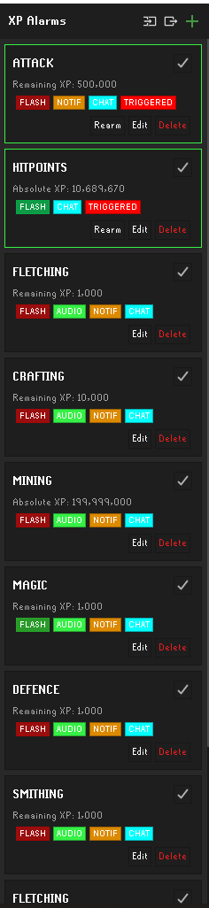
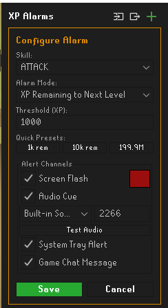
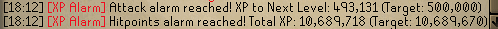

# xpAlarm - RuneLite Plugin

[](LICENSE)
[](https://www.oracle.com/java/)
[](https://runelite.net/plugin-hub)

A versatile, high-performance Old School RuneScape client plugin for RuneLite that allows players to track and configure custom XP and level alarms across every skill. Receive instant alerts via full-screen flashes, sound effects, custom audio clips, desktop notifications, and in-game chat messages.

<p align="center">
  
  
</p>

<p align="center">
  
</p>

---

## Features

- **Multi-Skill Alarm Tracking**: Monitor an unlimited number of concurrent alarms across all 23 skills.
- **Two Flexible Trigger Modes**:
  - `ABSOLUTE_XP`: Fires when total skill XP reaches or exceeds a specific threshold (e.g., 13,034,431 for level 99, 199,999,000 for 200M XP).
  - `REMAINING_XP_TO_LEVEL`: Fires when the XP remaining to reach the next level drops to or below a target value (e.g., 1,000 XP until next level).
- **Four Independent Alert Channels**:
  - **Screen Flash**: Full-screen customizable color flash with custom opacity and configurable frame duration.
  - **Audio Cue**: Play native RuneLite sound effects (by sound ID) or custom `.wav` audio files stored locally.
  - **System Tray Notification**: Native desktop notifications through RuneLite's `Notifier`.
  - **In-Game Chat Notification**: Formatted console messages highlighting the skill and target achieved.
- **Quick Presets**:
  - `1k rem`: 1,000 XP remaining to next level.
  - `10k rem`: 10,000 XP remaining to next level.
  - `199.99M`: 199,999,000 absolute skill XP.
- **Base64 Import & Export**:
  - Safely share and back up alarm lists via Base64 clipboard encoding.
  - Supports merging with existing alarms or cleanly overwriting lists.
- **Event Idempotency & Re-arming**:
  - In-memory session tracking prevents duplicate triggers during rapid XP drops (e.g., fletching darts, multi-tick skilling).
  - One-click manual "Rearm" button on triggered alarms to reset and monitor again.

---

## Installation & Setup

### RuneLite Plugin Hub
Search for **XP Alarm** in the RuneLite Plugin Hub and click **Install**.

### Custom Audio Setup
To use custom sound effects:
1. Ensure the custom sounds directory exists (the plugin automatically generates it on startup):
   - **Windows**: `C:\Users\<YourUsername>\.runelite\xpalarm\sounds\`
   - **macOS**: `~/.runelite/xpalarm/sounds/`
   - **Linux**: `~/.runelite/xpalarm/sounds/` or `~/.config/runelite/xpalarm/sounds/`
2. Drop standard `.wav` audio files (16-bit PCM recommended) into that folder.
3. Open the plugin's side panel editor, select **Custom WAV File**, pick your sound from the dropdown, and click **Test Audio** to verify playback.

---

## Configuration

| Option | Type | Default | Description |
| :--- | :--- | :--- | :--- |
| `Flash Duration (Frames)` | Integer (5–60) | `15` | Number of client render frames the screen flash overlay stays active. |
| `Enable Custom Sounds` | Boolean | `true` | Allows external `.wav` files to play from the `.runelite/xpalarm/sounds/` folder. |

---

## Building from Source

This project uses Gradle and targets Java 11+.

### Prerequisites
- JDK 11 or higher
- Git

### Build Instructions
```bash
# Clone repository
git clone https://github.com/IanMcNelly/xp-alarms.git
cd xp-alarms

# Compile and run unit tests
./gradlew test

# Build plugin jar
./gradlew build
```

---

## Contributing

Pull requests and issues are welcome! Please ensure:
1. All changes maintain Java 11 compatibility.
2. New features or fixes include appropriate unit tests in `src/test/java/`.
3. Adherence to standard RuneLite code formatting and conventions.

---

## License

This project is licensed under the **BSD 2-Clause License** in compliance with RuneLite Plugin Hub guidelines. See the [LICENSE](LICENSE) file for details.
